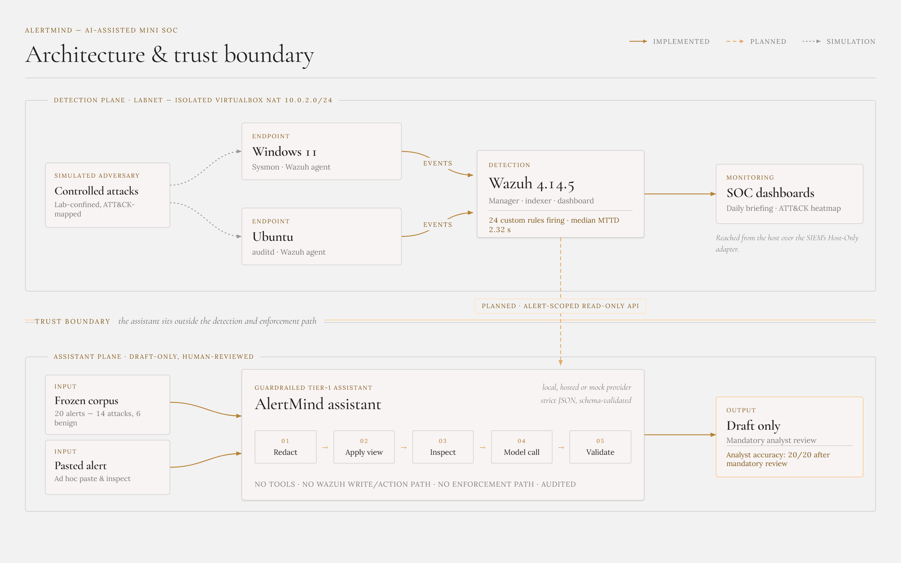
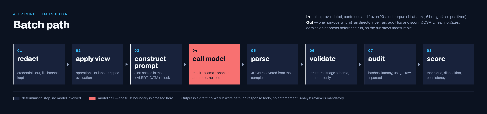
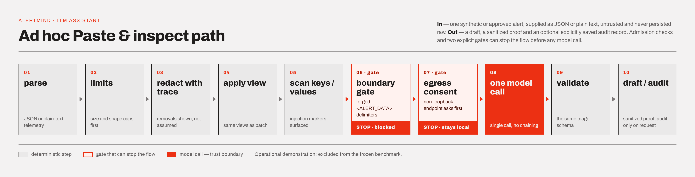
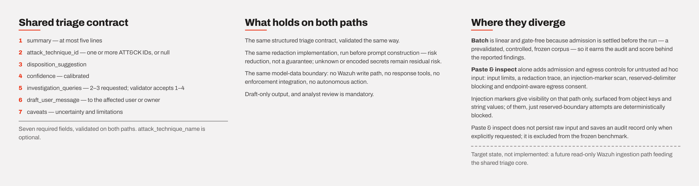

# AlertMind — AI-Assisted Mini SOC

> An end-to-end mini Security Operations Centre built around Wazuh: Windows and Linux telemetry, ATT&CK-mapped detections, SOC dashboards, incident-response playbooks, and a guardrailed LLM tier-1 assistant evaluated on a frozen benign-salted alert corpus.

[](https://github.com/opandey1/alertmind/actions/workflows/offline-ci.yml)

**Capstone:** PG Certificate in AI/GenAI Powered Cybersecurity — IIT Roorkee × Futurense, Cohort 1 · EC-Council SOC Essentials track · Project `CAP-SCE-3W` · Solo mode

**Current status:** Complete and submitted. The SOC build, detections, dashboards, playbooks, 90-day Wazuh alert-retention policy, assistant, Paste & inspect, frozen-corpus evaluation, grounding review, technical report and defense presentation are all delivered. Live Wazuh-to-assistant integration remains documented target-state work, not a completed feature. Post-v1 work has since implemented and independently evidenced the least-privilege Wazuh Indexer identities that path will use and the restricted transport beneath it, while OIDC/application authentication and authorization, the constrained reader and the live-alert UI stay unbuilt — see [Post-v1 RBAC and read-only ingestion status](#post-v1-rbac-and-read-only-ingestion-status).

For the complete methodology, evidence index, limitations and results, see the **[technical report](report.md)**. The **[defense presentation](docs/AlertMind_Defense.pdf)** summarises the build, the four measured findings and the deployment recommendation in 14 slides.

## What was delivered

| Component | Delivered state |
|---|---|
| Wazuh SIEM | Wazuh 4.14.5 all-in-one manager, indexer and dashboard in an isolated VirtualBox lab |
| Endpoint telemetry | Windows 11 with Sysmon and Wazuh agent; Ubuntu with auditd and Wazuh agent |
| Detection engineering | 24 custom Wazuh rules verified firing: Linux `100100–100116` and Windows `100200–100206`; built-in rule 61138 covers Windows service creation |
| ATT&CK coverage | Execution, persistence, credential access, privilege escalation, defense evasion, lateral movement, exfiltration and command-and-control scenarios |
| Dashboards | Daily SOC Briefing and ATT&CK Heatmap, exported as Wazuh `.ndjson` objects under `siem/dashboards/` |
| Alert retention | `wazuh-alert-retention-policy` applied to `wazuh-alerts-4.x-*`; 90-day delete transition configured and 21 managed indices verified |
| IR playbooks | Phishing, malware and account-compromise playbooks following the NIST SP 800-61r2 four-phase lifecycle, as specified by the capstone brief |
| LLM assistant | Python/Streamlit assistant with local, hosted and deterministic mock providers; strict JSON output, redaction, views, audit logging and scoring |
| Paste & inspect | Ad hoc JSON or plain-text alert triage with limits, redaction trace, injection markers, boundary gate, endpoint-aware consent and sanitized proof/audit output |
| Evaluation | Frozen 20-alert corpus: 14 controlled attacks plus 6 historical benign false positives; paired timing, automated scoring and provenance-recorded grounding review |

## Architecture and trust boundary

The lab VMs share an isolated VirtualBox NAT network (`LabNet`, `10.0.2.0/24`). The SIEM has a Host-Only adapter for dashboard access. The assistant is not inline with detection or enforcement.



**Solid** lines are implemented flows, **dashed** lines are planned target state, and **dotted** lines are simulated adversary activity. Full architecture, log sources, retention and the RBAC model: **[`architecture/soc-architecture.md`](architecture/soc-architecture.md)** · editable diagram source [`architecture/diagram.drawio`](architecture/diagram.drawio) → [`architecture/diagram.png`](architecture/diagram.png).

Current assistant inputs are the frozen corpus and analyst-pasted JSON or plain text. The dashed live-ingestion path is the production target and is **not yet implemented**: no application code retrieves alerts from Wazuh. Post-v1 work has since built the identity layer beneath that path — `socanalyst` and `assistant-svc` now exist as least-privilege Wazuh Indexer identities with enforcement verified live, and the restricted host-only SSH transport has independently reviewed live evidence (see [Post-v1 RBAC status](#post-v1-rbac-and-read-only-ingestion-status)) — while OIDC/application authentication and authorization, the constrained reader and the live-alert UI remain unbuilt. When that path is implemented it will read the Indexer alert API on `:9200` (`wazuh-alerts-4.x-*`), not the Wazuh Server API on `:55000`, which is a management plane the assistant holds no credential for.

Alert retention is implemented separately in the Wazuh Indexer. The 90-day policy was configured on 29 Jul 2026 and verified attached to 21 daily alert indices, including indices created after the policy update. The evidence proves policy attachment and active transition evaluation; actual age-based deletion remains unobserved because no index had yet reached 90 days. See [`architecture/soc-architecture.md` §7](architecture/soc-architecture.md#7-data-retention), the [policy screenshot](evidence/week3/wazuh-alert-retention-policy-90d.png), and the [managed-index screenshot](evidence/week3/wazuh-alert-retention-managed-indices.png).

## Key measured findings

The project deliberately separates detection latency from analyst triage time:

- **MTTD:** attack timestamp → Wazuh alert timestamp. Median **2.32 seconds**; this is a property of detection and forwarding, not the assistant.
- **Time-to-triage:** analyst opens alert → disposition complete. Model inference was pre-generated and reported separately.

### Timed llama3.1-assisted pass

| Alert class | n | Unassisted median | Assisted median | Result |
|---|---:|---:|---:|---|
| Attacks, assistant disposition correct | 14 | 11.43 min | 8.00 min | **−30%**; all 14 faster |
| Benign false positives, assistant disposition wrong | 6 | 5.58 min | 7.70 min | **+38%**; paired median cost **+1.68 min** |
| All alerts | 20 | 10.50 min | 8.00 min | Aggregate −24% hides the opposite class effects |

Analyst disposition accuracy stayed **20/20** in both passes because every incorrect assistant disposition was independently reviewed and corrected by the analyst. This demonstrates that human review worked in this single-analyst study, but also that review has a measurable cost. No formal or audited override mechanism was implemented.

### Model comparison: strict scoring and operational grounding

The operational alert contains its rule-authored ATT&CK label. A separate evaluation view removes the tested label-bearing fields before scoring to avoid measuring label copying. The two free-text grounding rows below are labelled separately because that review used the operational outputs, not the strict-view outputs. Grounding began as a human-authored first pass and then received an evidence-led Codex second pass against each complete operational prompt. The per-alert worksheets record every changed dimension; one human explicitly approved all changes on 2026-08-31, so the agent pass is an audit aid rather than an independent second human review.

| Measure | `llama3.1:8b` | `qwen3:8b` | `gpt-5.5-2026-04-23` |
|---|---:|---:|---:|
| Attack technique, operational exact / relaxed | **14/14 · 14/14** | **14/14 · 14/14** | 11/14 · 14/14 |
| Attack technique, strict exact / relaxed | 1/14 · 1/14 | 2/14 · 5/14 | **8/14 · 12/14** |
| Disposition, all alerts (strict) | 14/20 | 14/20 | **16/20** |
| Benign false positives cleared (strict) | **0/6** | **1/6**, with 3 hedged and 2 confidently wrong | **3/6**, with 3 hedged and 0 confidently wrong |
| Summaries fully supported (operational grounding) | 12/20 (8 partial) | 12/20 (8 partial) | **20/20** |
| Investigation queries runnable (operational grounding) | **0/20** | **0/20** | **15/20** |
| Valid JSON across matched operational + evaluation runs | 40/40 | 40/40 | 40/40 |
| Prompt tokens, median (strict run) | 963.5 | 1,522.0 | 970.0 |
| Completion tokens, median (strict run) | 218.5 | 306.0 | 786.5 |
| Reasoning-token subset, median (strict run) | Not separately reported | Not separately reported | 337.5 |
| End-to-end call latency, median / 20-call total (strict run) | 60.37 s / 21.18 min | 168.21 s / 59.83 min | **10.66 s / 3.81 min** |

The automated comparison uses llama3.1 runs `20260715_060542_ollama_oper_baseline` / `20260718_180713_ollama_eval_baseline`, qwen3:8b runs `20260830_054251_ollama_oper_baseline` / `20260830_070142_ollama_eval_baseline`, and GPT-5.5 runs `20260717_073045_openai_oper_baseline` / `20260718_183704_openai_eval_baseline`. The llama operational grounding worksheet uses an earlier output sample, `20260713T115729Z_ollama_operational`; its free-text verdicts are not attributed to the later 14/14 operational run. Across all three strict runs, all 20 `input_hash` and serialized `redacted_prompt_hash` values match. Qwen records a later redaction implementation version, but its 20 serialized prompts still match the other strict runs byte-for-byte. Token counts remain tokenizer-specific and are not evidence of input equivalence. GPT-5.5 completion tokens include its separately reported reasoning-token subset; Ollama's missing separate reasoning count must not be read as proof of no internal reasoning.

The grounding rubric treats a query set as runnable only when every item can execute against its stated target as written. For Wazuh/OpenSearch Discover that means indexed fields such as `data.audit.*` / `data.win.*`; rule-decoder names, prose, undefined pseudo-SQL, and incomplete or unsafe shell fragments fail the all-or-nothing set. This target-aware standard is stricter than the initial syntax-only pass, was applied uniformly to all three worksheets, and all resulting verdict changes were explicitly approved by the human reviewer. Provenance and exact per-alert changes are committed under `measurement/grounding/`.

The earlier llama run's committed scoring CSV is preserved as an **as-run historical artifact** from the then-current single-ID validator: A13 and A19 were parsed correctly but marked `schema_invalid` because their slash-joined ATT&CK IDs were rejected. A retrospective re-score of the unchanged audit log with the current multi-ID validator yields **13/14 exact, 14/14 relaxed, 14/20 disposition, 20/20 consistent and 14/20 overall**; A10 is the sole exact-ID miss. Those derived figures describe the earlier grounding-source run and do not replace the matched `20260715_060542` automated result of 14/14 exact.

This is an exploratory system-level comparison, not a controlled model benchmark: model scale, training, hosting, tokenizer, reasoning configuration and sampling differ simultaneously. The extra GPT-5.5 reasoning tokens are an observed usage difference, not evidence that reasoning tokens caused the quality difference. Latency is the observed end-to-end call time on the measured laptop CPU and hosted service, not an intrinsic speed ranking. GPT-5.5 is one stochastic sample per view; Qwen is one accepted matched pair and showed output variability across retained candidate/final runs despite a recorded seed. The timed assisted pass was not repeated with either comparison model.

The corpus is frozen at `measurement/alert-corpus.json`:

```text
SHA-256  4E842637F3CBCBB6E0704320824B64BDEB63C7D7EE7E22DB0278E4D96C58B929
```

## LLM assistant

The implementation is [`assistant/`](assistant/). The benchmark run logs used by the report are retained under `assistant/outputs/runs/`, one non-overwriting directory per run.

For each alert, the assistant returns:

1. A summary of at most five lines.
2. One or more MITRE ATT&CK technique IDs, or `null`, with an optional technique name.
3. A disposition suggestion and calibrated confidence.
4. Two or three suggested investigation queries.
5. A draft message to the affected user or system owner.
6. Caveats describing uncertainty and limitations.

**Batch path** — the measured pipeline over the prevalidated, controlled and frozen corpus. Linear and gate-free, because admission is settled before the run:

[](architecture/assistant-batch-path.png)

<details>
<summary>Text version</summary>

```text
redact → apply view → construct prompt → call model → parse → validate → audit → score
providers: mock · ollama · openai · anthropic
```

</details>

**Ad hoc Paste & inspect path** — one synthetic or approved alert, supplied as JSON or plain text, behind input limits, a redaction trace, an injection-marker scan and two gates:

[](architecture/assistant-adhoc-paste-inspect-path.png)

<details>
<summary>Text version</summary>

```text
parse → limits → redact with trace → apply view → final model_bound object
        ├─ marker scan (side branch) → markers shown to analyst; visibility only, never gates
        └─ boundary gate → egress consent → one model call → validate → draft → optional audit
admission: parsing and input limits can reject the request before either labelled gate
gates: literal <ALERT_DATA> / </ALERT_DATA> delimiters are blocked; a non-loopback endpoint
       needs consent
independence: the boundary gate re-serialises model_bound and substring-tests it; it does not
       consume the marker-scan result, so a scanner miss cannot open the gate
```

</details>

Both paths use the same structured triage contract, redaction implementation, model-data boundary and draft-only review posture. Paste & inspect adds admission, injection-visibility and egress controls for untrusted ad hoc input.

[](architecture/assistant-paths-notes.png)

<details>
<summary>Text version</summary>

```text
Shared triage contract — seven required fields, attack_technique_name optional:
  summary · attack_technique_id · disposition_suggestion · confidence
  investigation_queries (2–3 requested, validator accepts 1–4)
  draft_user_message · caveats

Both paths       same triage contract and validation; same redaction implementation;
                 same model-data boundary (no Wazuh write path, no response tools,
                 no enforcement, no autonomous action); draft-only output with
                 mandatory analyst review.

Paste & inspect  input limits; redaction trace; injection-marker scan over object keys
only             and string values; reserved-delimiter blocking; endpoint-aware egress
                 consent; raw input not persisted; audit record saved only when
                 explicitly requested; excluded from the frozen benchmark.

Scan vs gate     the marker scan is visibility; the boundary gate is enforcement. Both
                 inspect the model-bound object independently, so a scanner miss cannot
                 permit a literal reserved-delimiter breakout. Other instruction-shaped
                 markers may still reach the model; only literal reserved-delimiter
                 attempts are deterministically blocked.

Target state     a future read-only Wazuh ingestion path feeding the shared triage core.
```

</details>

Paste & inspect is an operational demonstration and was excluded from the frozen benchmark.

### Guardrail claims and boundaries

- **No autonomous action:** the model has no Wazuh write/action path, no response tools and no enforcement integration; every result is a draft requiring analyst review.
- **Redaction first:** tested credential classes and sensitive-key values are removed before prompt construction. File hashes remain available as investigation IOCs.
- **Redaction is risk reduction:** unknown, encoded or unlabelled secrets remain residual risk.
- **Prompt-injection handling in Paste & inspect:** tested instruction markers are surfaced from object keys and string values, including wrapped plain-text telemetry, and reserved `<ALERT_DATA>` delimiter attempts are blocked before a model call. The batch runner does not implement these runtime admission controls; it operates on the prevalidated frozen corpus.
- **No general injection-prevention claim:** other marked text may still reach the model as evidence inside an untrusted-data block and may influence its reasoning. Schema validation checks structure, not correctness.
- **Impact containment:** redacted input, no Wazuh write/action path, no response tools, no enforcement integration, draft-only output and mandatory review limit the consequence of a bad response.
- **Endpoint-aware consent in Paste & inspect:** non-loopback model endpoints require explicit consent before alert data is sent externally. Batch hosted-provider runs are explicitly initiated from the CLI and do not use this interactive consent gate.
- **Sanitized ad hoc evidence:** raw pasted input is not persisted; proof and audit records store sanitized data and a correlation hash. Optional trace correlation uses keyed HMAC via `ALERTMIND_TRACE_HMAC_KEY`.
- **Auditability:** batch calls record model/configuration, prompt and redaction hashes, latency, parse status, usage and raw/parsed responses in non-overwriting run directories.

## Post-v1 RBAC and read-only ingestion status

Work after the submitted `v1.0` tag is building the least-privilege identity layer that a future live-ingestion path would sit on. It is deliberately partial, and the split matters when reading the repository:

**Implemented and independently reviewed — Indexer identities.** Two dedicated Wazuh Indexer identities exist and their boundary was exercised against the live cluster. `alertmind_assistant_alerts_ro` holds no cluster permission, no tenant permission and no Server API identity — only `indices:data/read/search` and `indices:data/read/get` on `wazuh-alerts-4.x-*`, with document-level security limited to `agent.id` `001` and `002`. Wazuh Dashboard multitenancy is disabled and the service identity has no configured Dashboard tenant; `authinfo` still reports private-tenant metadata, which is metadata rather than Indexer role authority. The live proof recorded a successful bounded read of an in-scope document alongside `403` denials for create, update and delete from the same principal, with the source document's hash unchanged before and after. Setup also found and closed an inherited `own_index` grant that would have given both new identities write access to a self-named index. Sanitized evidence, containing identifiers and hashes but no credentials or raw alerts, is under [`evidence/rbac/`](evidence/rbac/); the secret-free role, mapping and scope templates are under [`siem/rbac/`](siem/rbac/) and are pinned against drift by the offline contract tests.

**Implemented and independently reviewed — restricted transport.** The host-only SSH local forward was exercised end to end by the project owner: the VM listener bound only to the host-only address, the client forward bound only to Windows loopback, the pinned host-key fingerprint and CA digest checked, a paired TLS proof rejected the wrong certificate identity and accepted the correct one, and shell, PTY, remote-forward, alternate-destination and password-only attempts were denied with all four Wazuh services active before and after. The sanitized [Phase 1C transport evidence](evidence/rbac/phase1c-ssh-transport-proof.md) and its drift-binding tests were independently reviewed and merged through PR #16. This closes the transport evidence gate only; the rollback/revocation drill remains pending, so Phase 1C as a whole is not complete.

**Not implemented.** There is no OIDC authentication, no application authorization, no constrained reader module, no live-alert UI and no audit integration. The assistant application still consumes only the frozen corpus and analyst-pasted input, exactly as in `v1.0`; nothing in it reads from Wazuh.

**Claim discipline.** Nothing here changes a published measurement: live alerts are excluded from the frozen benchmark by design, and no model was re-run. The plan, work order, acceptance criteria and rollback are in [`docs/rbac-wazuh-read-only-implementation-plan.md`](docs/rbac-wazuh-read-only-implementation-plan.md), with operator procedures in [`docs/runbooks/rbac-wazuh-read-only-setup.md`](docs/runbooks/rbac-wazuh-read-only-setup.md) and [`docs/runbooks/rbac-wazuh-ssh-transport.md`](docs/runbooks/rbac-wazuh-ssh-transport.md). The `v1.0` tag and the submitted report and deck are preserved unedited; the lab has since been upgraded to Wazuh 4.14.7, so live-state notes are recorded separately from the 4.14.5 submission baseline.

## Repository map

```text
alertmind/
├── README.md                          # this file — repository landing page
├── report.md                          # final technical report and evidence index
├── WEEKLOG.md                         # week-by-week implementation chronology
├── .gitignore                         # excludes .env, venvs, local secrets/certs and runtime ad hoc audit output
├── .gitattributes                     # pins hash-checked artifacts to LF so documented SHA-256 survives checkout
│
├── .github/workflows/
│   └── offline-ci.yml                 # network-free regression + frozen-evidence CI
│
├── architecture/
│   ├── soc-architecture.md            # authoritative architecture: flows, retention, RBAC, trust boundary
│   ├── diagram.drawio                 # editable source
│   ├── diagram.png                    # rendered diagram
│   ├── assistant-batch-path.png       # batch pipeline figure used in README.md
│   ├── assistant-adhoc-paste-inspect-path.png   # ad hoc pipeline figure used in README.md
│   └── assistant-paths-notes.png      # triage contract, shared guardrails, divergence
│
├── assistant/                         # assistant package, Paste & inspect UI, tests, run logs
│                                      # (see assistant/README.md for module-level detail)
│
├── detections/
│   ├── auditd/alertmind.rules         # Linux auditd collection rules
│   └── sigma/
│       ├── linux/ · windows/          # 25 portable Sigma YAML sources
│       └── notes.md                   # Sigma-to-Wazuh crosswalk and tuning notes
│
├── siem/
│   ├── wazuh/local_rules.xml          # 24 deployed custom Wazuh rules
│   ├── dashboards/*.ndjson            # ATT&CK Heatmap · Daily SOC Briefing exports
│   └── rbac/                          # secret-free least-privilege identity package
│       ├── indexer-role_*.json        # socanalyst and assistant-svc Indexer roles
│       ├── indexer-role-mapping_*.json        # direct-user mappings; no backend roles or hosts
│       ├── indexer-role-mapping_own_index_*.patch.json  # scoped/rollback patches for the inherited own_index mapping
│       ├── scope-contract.json        # pinned index pattern, DLS terms, principals, agent fingerprints
│       ├── negative-test-matrix.md    # pre-registered fail-safe read/write denial sequence
│       ├── sshd-alertmind.conf        # host-only, local-forward-only SSH drop-in
│       ├── ssh-authorized-key-options.txt      # key-option prefix; contains no key material
│       └── SHA256SUMS · SSH-SHA256SUMS         # transfer manifests for the payloads above
│
├── attack/
│   └── runbook.md                     # per-rule trigger commands, provenance and teardown
│
├── playbooks/                         # phishing · malware · account-compromise (NIST 800-61r2)
│
├── measurement/
│   ├── alert-corpus.json              # frozen 20-alert corpus (hash below)
│   ├── timing-log.csv                 # unassisted and assisted triage timings
│   ├── assisted-timing-protocol.md    # timing protocol and its threats to validity
│   ├── analysis.ipynb                 # re-runnable metric derivation
│   ├── verify_frozen_evidence.py      # offline assertions re-derived by CI
│   ├── grounding/                     # manual free-text review worksheets and rubric
│   └── run-manifests/                 # provenance, model capture and normalized audit hashes
│
├── deployment/
│   └── oidc/keycloak/                 # reference local IdP notes; realm template deferred until Phase 2
│
├── docs/
│   ├── AlertMind_Defense.pdf          # defense presentation (14 slides)
│   ├── rebuild-guide.md               # rebuild the lab from a clean clone
│   ├── artifacts.md                   # artifact index
│   ├── rbac-wazuh-read-only-implementation-plan.md   # post-v1 RBAC and read-only ingestion plan
│   └── runbooks/
│       ├── wazuh-recovery.md          # SIEM recovery after host failure
│       ├── wazuh-password-reset.md    # credential reset procedure
│       ├── rbac-wazuh-read-only-setup.md          # read-only inventory and identity setup
│       └── rbac-wazuh-ssh-transport.md            # restricted host-only SSH transport gate
│
└── evidence/                          # screenshots and command-output evidence (EVID-* IDs)
    └── rbac/                          # sanitized RBAC gate evidence (no credentials or raw alerts)
```

## Run the assistant

The examples below use PowerShell from the repository root.

```powershell
cd assistant
python -m venv .venv
.\.venv\Scripts\Activate.ps1
python -m pip install -r requirements.txt
```

Run the offline smoke test and UI:

```powershell
python runner.py --provider mock --view operational --limit 1
python -m streamlit run app.py
```

Run with local Ollama (use the **exact** tag from `ollama list` — `llama3.1:8b`, with the colon):

```powershell
python preflight.py --provider ollama --model llama3.1:8b
python runner.py --provider ollama --model llama3.1:8b --view evaluation
```

Run with the pinned hosted model:

```powershell
$env:OPENAI_API_KEY="<your-key>"
$env:OPENAI_BASE_URL="https://api.openai.com/v1"
$env:ALERTMIND_MAX_TOKENS="25000"
python preflight.py --provider openai --model gpt-5.5-2026-04-23
python runner.py --provider openai --model gpt-5.5-2026-04-23 --view evaluation
```

Do not commit a populated `.env`; keep secrets outside the repository and use `.env.example` as the template.

## Tests and reproducibility

Run the assistant regression suite:

```powershell
cd assistant
python -m unittest discover -s tests -p "test_*.py"
```

The current suite contains **106 tests** covering provider request construction, schema/error metadata, runtime/formal-schema alignment, non-destructive audit reconstruction, explicit corpus-subset selection, redaction, strict-view label leakage, injection markers, boundary blocking, consent, ad hoc audit semantics, Streamlit state handling, and the offline RBAC contract checks that pin the committed identity, role, DLS, transport and unexecuted rollback/revocation packages against drift.

Re-score a retained audit log without changing committed evidence:

```powershell
cd assistant
python rebuild_from_audit.py outputs/runs/<run_id>/audit-log.jsonl --score-only
```

Omitting `--score-only` writes derived files under `assistant/outputs/rebuilt/<run_id>/`, not beside the source audit log. Existing derived files require an explicit `--overwrite`, and the timing-log default is resolved from the repository rather than the caller's working directory.

**Offline CI.** Every push to `main` and pull request targeting it runs the 106-test regression suite and re-derives the CI-protected assistant-evaluation findings from committed artifacts: frozen-corpus and timing-log SHA-256, canonical scoring for seven retained result-bearing runs, the §9.8 token/latency/hash findings, and the accepted Qwen pair's normalized audit hashes, manifests, model digest and effective request configuration. No live SIEM, model provider, credentials or repository secrets are required. The badge therefore shows that these specific committed measurements still reproduce without another model call. It does not cover MTTD, the assisted-timing study, human grounding verdicts, dashboards or detection counts, which are evidenced elsewhere in this repository. Workflow: [`.github/workflows/offline-ci.yml`](.github/workflows/offline-ci.yml); assertions: [`measurement/verify_frozen_evidence.py`](measurement/verify_frozen_evidence.py).

**Rebuilding the lab from a clean clone:** follow [`docs/rebuild-guide.md`](docs/rebuild-guide.md). Recovery and credential-reset procedures are in [`docs/runbooks/`](docs/runbooks/), and [`docs/artifacts.md`](docs/artifacts.md) indexes the produced artifacts.

Reproduce the analysis by running [`measurement/analysis.ipynb`](measurement/analysis.ipynb) top to bottom; it derives MTTD directly from the frozen-corpus timestamps, so the reported 2.32 s is re-derivable without any model access. The timing protocol and its limitations are in [`measurement/assisted-timing-protocol.md`](measurement/assisted-timing-protocol.md). Grounding worksheets and reviewer notes are under [`measurement/grounding/`](measurement/grounding/). The main result-bearing run directories are:

- `assistant/outputs/runs/20260715_060542_ollama_oper_baseline/` — matched llama3.1 operational baseline
- `assistant/outputs/runs/20260718_180713_ollama_eval_baseline/`
- `assistant/outputs/runs/20260713T115729Z_ollama_operational/` — earlier llama3.1 operational sample used for manual grounding
- `assistant/outputs/runs/20260718_183704_openai_eval_baseline/`
- `assistant/outputs/runs/20260717_073045_openai_oper_baseline/`
- `assistant/outputs/runs/20260717_074112_openai_eval_baseline/` — superseded, still-leaky evaluation view retained as history
- `assistant/outputs/runs/20260830_054251_ollama_oper_baseline/` — accepted qwen3:8b operational extension
- `assistant/outputs/runs/20260830_070142_ollama_eval_baseline/` — accepted qwen3:8b strict extension

The superseded Qwen pilots and pre-commit candidate pair remain committed for transparency. The accepted pair above ran on committed code; its provenance disclosures, model capture and newline-normalized audit hashes are in [`measurement/run-manifests/`](measurement/run-manifests/).

## Detection and response content

- Architecture and trust boundary: [`architecture/soc-architecture.md`](architecture/soc-architecture.md)
- Attack-simulation runbook — per-rule trigger commands, provenance labels and teardown: [`attack/runbook.md`](attack/runbook.md)
- Portable Sigma sources (25 rules): [`detections/sigma/linux/`](detections/sigma/linux/) · [`detections/sigma/windows/`](detections/sigma/windows/)
- Detection crosswalk and tuning decisions: [`detections/sigma/notes.md`](detections/sigma/notes.md)
- Linux auditd collection: [`detections/auditd/alertmind.rules`](detections/auditd/alertmind.rules)
- Deployed Wazuh rules: [`siem/wazuh/local_rules.xml`](siem/wazuh/local_rules.xml)
- Wazuh dashboards: [`siem/dashboards/`](siem/dashboards/)
- Phishing playbook: [`playbooks/phishing.md`](playbooks/phishing.md)
- Malware playbook: [`playbooks/malware.md`](playbooks/malware.md)
- Account-compromise playbook: [`playbooks/account-compromise.md`](playbooks/account-compromise.md)

## Current limitations and remaining work

- The 20-alert, single-analyst lab study is directional rather than statistically powered; the assisted pass also followed the unassisted pass after a washout.
- Local and hosted model results are not a controlled capability comparison, and hosted results are single stochastic samples.
- The post-v1 qwen3:8b extension adds a second local 8B model with the same corpus, prompt, views, automated scoring and manual grounding rubric. It remains one matched pair rather than a performance distribution, and its inference settings differ from llama3.1.
- One synthetic attack payload identifies itself as an AlertMind test after decoding, creating a documented construct-validity limitation.
- Redaction does not guarantee removal of unknown or encoded secrets.
- Prompt-injection markers provide detection and visibility; only reserved-boundary attempts are deterministically blocked. Semantic model influence remains possible.
- Least-privilege Wazuh Indexer identities `socanalyst` and `assistant-svc` and the restricted host-only SSH transport now have independently reviewed live evidence. Live read-only ingestion is still not implemented: OIDC authentication, application authorization, the constrained reader and the live-alert UI all remain unbuilt, no application code reads from Wazuh, and the transport rollback/revocation drill is still pending. See [Post-v1 RBAC and read-only ingestion status](#post-v1-rbac-and-read-only-ingestion-status).
- The lab certificate chain publishes no CRL distribution point or Authority Information Access, so revocation cannot be evaluated for it; a reviewed certificate-chain replacement is the intended fix rather than relaxing verification.
- High-confidence injection quarantine with an explicit audited override remains future work.
- Live cloud ingestion is an optional stretch goal; the project uses the required Windows and Linux sources. A static cloud sample was demonstrated only.
- The IR playbooks follow NIST SP 800-61r2, which was superseded by r3 in April 2025; migration to the r3 CSF-aligned structure is follow-on work.

## Responsible AI, ethics and attribution

All attack simulation was confined to the isolated lab. The corpus contains synthetic lab events and historical lab false positives, not customer data. Redacted synthetic alerts were sent to the hosted model only for the disclosed comparison runs; the local measured runs had no alert-data egress.

The alert-summarization starting point was adapted from the author's prior [AI-SOC-Assistant](https://github.com/opandey1/AI-SOC-Assistant) project. AlertMind adds the SOC-specific prompts, provider abstraction, redaction, strict views, schema validation, audit/scoring pipeline, reproducible evaluation, grounding review and Streamlit workflows. Development-assistance use is disclosed in `report.md`; reported results derive from retained logs and re-runnable artifacts.

## References

- [MITRE ATT&CK](https://attack.mitre.org/)
- [NIST SP 800-61r2](https://csrc.nist.gov/pubs/sp/800/61/r2/final) — the four-phase lifecycle the playbooks follow, as specified by the brief
- [NIST SP 800-61r3](https://csrc.nist.gov/pubs/sp/800/61/r3/final) — superseded r2 in April 2025 and restructures incident response around the CSF 2.0 functions; migrating the playbooks is documented follow-on work
- [NIST Cybersecurity Framework 2.0](https://www.nist.gov/cyberframework)
- [Wazuh documentation](https://documentation.wazuh.com/)

---

*Built for the IIT Roorkee × Futurense PG Certificate in AI/GenAI Powered Cybersecurity, Cohort 1.*
