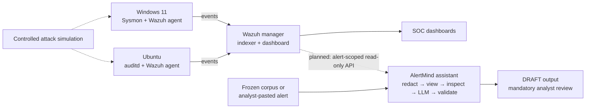

# AlertMind — AI-Assisted Mini SOC

> An end-to-end mini Security Operations Centre built around Wazuh: Windows and Linux telemetry, ATT&CK-mapped detections, SOC dashboards, incident-response playbooks, and a guardrailed LLM tier-1 assistant evaluated on a frozen benign-salted alert corpus.

**Capstone:** PG Certificate in AI/GenAI Powered Cybersecurity — IIT Roorkee × Futurense, Cohort 1 · EC-Council SOC Essentials track · Project `CAP-SCE-3W` · Solo mode

**Current status:** Core SOC build, detections, dashboards, playbooks, assistant, frozen-corpus evaluation, grounding review and technical report are complete. The defense presentation remains to be created. Live Wazuh-to-assistant integration and production RBAC remain documented target-state work, not completed features.

For the complete methodology, evidence index, limitations and results, see the [technical report](report.md).

## What was delivered

| Component | Delivered state |
|---|---|
| Wazuh SIEM | Wazuh 4.14.5 all-in-one manager, indexer and dashboard in an isolated VirtualBox lab |
| Endpoint telemetry | Windows 11 with Sysmon and Wazuh agent; Ubuntu with auditd and Wazuh agent |
| Detection engineering | 24 custom Wazuh rules verified firing: Linux `100100–100116` and Windows `100200–100206`; built-in rule 61138 covers Windows service creation |
| ATT&CK coverage | Execution, persistence, credential access, privilege escalation, defense evasion, lateral movement, exfiltration and command-and-control scenarios |
| Dashboards | Daily SOC Briefing and ATT&CK Heatmap, exported as Wazuh `.ndjson` objects under `siem/dashboards/` |
| IR playbooks | Phishing, malware and account-compromise playbooks aligned to NIST SP 800-61r2 |
| LLM assistant | Python/Streamlit assistant with local, hosted and deterministic mock providers; strict JSON output, redaction, views, audit logging and scoring |
| Paste & inspect | Ad hoc JSON-alert triage with limits, redaction trace, injection markers, boundary gate, endpoint-aware consent and sanitized proof/audit output |
| Evaluation | Frozen 20-alert corpus: 14 controlled attacks plus 6 historical benign false positives; paired timing, automated scoring and manual grounding review |

## Architecture and trust boundary

The lab VMs share an isolated VirtualBox NAT network (`LabNet`, `10.0.2.0/24`). The SIEM has a Host-Only adapter for dashboard access. The assistant is not inline with detection or enforcement.



Current assistant inputs are the frozen corpus and analyst-pasted JSON. The dotted Wazuh API path is the production target and is **not yet implemented**. Correspondingly, the target identities `socanalyst` and `assistant-svc` remain planned; the lab currently uses `admin` for setup and validation.

## Key measured findings

The project deliberately separates detection latency from analyst triage time:

- **MTTD:** attack timestamp → Wazuh alert timestamp. Median **2.32 seconds**; this is a property of detection and forwarding, not the assistant.
- **Time-to-triage:** analyst opens alert → disposition complete. Model inference was pre-generated and reported separately.

### Timed llama3.1-assisted pass

| Alert class | n | Unassisted median | Assisted median | Result |
|---|---:|---:|---:|---|
| Attacks, assistant disposition correct | 14 | 11.43 min | 8.00 min | **−30%**; all 14 faster |
| Benign false positives, assistant disposition wrong | 6 | 5.58 min | 7.70 min | **+38%**; paired median cost **+1.68 min** |
| All alerts | 20 | 10.50 min | 8.00 min | Aggregate −24% hides the opposite class effects |

Analyst disposition accuracy stayed **20/20** in both passes because every incorrect assistant disposition was overridden. This demonstrates that human review worked in this single-analyst study, but also that review has a measurable cost.

### Strict label-reduced assistant comparison

The operational alert contains its rule-authored ATT&CK label. A separate evaluation view removes the tested label-bearing fields before scoring to avoid measuring label copying.

| Measure | `llama3.1:8b` | `gpt-5.5-2026-04-23` |
|---|---:|---:|
| Attack technique, exact / relaxed | 1/14 · 1/14 | **8/14 · 12/14** |
| Disposition, all alerts | 14/20 | **16/20** |
| Benign false positives cleared | **0/6** | **3/6**, with 3 hedged and 0 confidently wrong |
| Operational summaries fully supported | 15/20 | **20/20** |
| Operational investigation queries runnable | **0/20** | **20/20** |
| Valid JSON across matched operational + evaluation runs | 40/40 | 40/40 |

This is an exploratory system-level comparison, not a controlled model benchmark: model scale, training, hosting, reasoning and sampling differ simultaneously. GPT-5.5 is one stochastic sample per view, and the timed assisted pass was not repeated with it.

The corpus is frozen at `measurement/alert-corpus.json`:

```text
SHA-256  4E842637F3CBCBB6E0704320824B64BDEB63C7D7EE7E22DB0278E4D96C58B929
```

## LLM assistant

The implementation is [`assistant/`](assistant/). The benchmark run logs used by the report are retained under `assistant/outputs/runs/`, one non-overwriting directory per run.

For each alert, the assistant returns:

1. A summary of at most five lines.
2. One or more MITRE ATT&CK technique IDs, or `null`.
3. Two or three suggested investigation queries.
4. A draft message to the affected user or system owner.
5. A disposition suggestion and calibrated confidence.

Batch path:

```text
redact → apply view → construct prompt → call model → parse → validate → audit → score
```

Ad hoc Paste & inspect path:

```text
parse → limits → redact with trace → apply view → scan keys/values
      → boundary gate → egress consent → one model call → validate → draft/audit
```

Paste & inspect is an operational demonstration and was excluded from the frozen benchmark.

### Guardrail claims and boundaries

- **No autonomous action:** the model has no tools, enforcement path or write capability; every result is a draft requiring analyst review.
- **Redaction first:** tested credential classes and sensitive-key values are removed before prompt construction. File hashes remain available as investigation IOCs.
- **Redaction is risk reduction:** unknown, encoded or unlabelled secrets remain residual risk.
- **Prompt-injection handling:** tested instruction markers are surfaced from JSON keys and values, and reserved `<ALERT_DATA>` delimiter attempts are blocked before a model call.
- **No general injection-prevention claim:** other marked text may still reach the model as evidence inside an untrusted-data block and may influence its reasoning. Schema validation checks structure, not correctness.
- **Impact containment:** redacted input, no tools/write capability, draft-only output and mandatory review limit the consequence of a bad response.
- **Endpoint-aware consent:** non-loopback model endpoints require explicit consent before alert data is sent externally.
- **Sanitized ad hoc evidence:** raw pasted input is not persisted; proof and audit records store sanitized data and a correlation hash. Optional trace correlation uses keyed HMAC via `ALERTMIND_TRACE_HMAC_KEY`.
- **Auditability:** batch calls record model/configuration, prompt and redaction hashes, latency, parse status, usage and raw/parsed responses in non-overwriting run directories.

## Repository map

```text
project-alertmind/
├── README.md                         # repository landing page
├── report.md                         # final technical report and evidence index
├── WEEKLOG.md                        # implementation chronology
├── assistant/                        # assistant package, Paste & inspect UI, tests, run logs
├── detections/
│   ├── auditd/alertmind.rules        # Linux collection rules
│   └── sigma/notes.md                # Sigma-to-Wazuh crosswalk and tuning notes
├── siem/
│   ├── wazuh/                        # deployed Wazuh/Sysmon configuration exports
│   └── dashboards/                   # final and earlier dashboard exports
├── playbooks/                        # phishing, malware, account-compromise
├── measurement/
│   ├── alert-corpus.json             # frozen 20-alert corpus
│   ├── timing-log*.csv               # unassisted and assisted timing
│   ├── analysis.ipynb                # re-runnable metric derivation
│   └── grounding/                    # manual free-text review worksheets
└── evidence/                         # screenshots and command-output evidence
```

## Run the assistant

The examples below use PowerShell from the repository root.

```powershell
cd assistant
python -m venv .venv
.\.venv\Scripts\Activate.ps1
python -m pip install -r requirements.txt
```

Run the offline smoke test and UI:

```powershell
python runner.py --provider mock --view operational --limit 1
python -m streamlit run app.py
```

Run with local Ollama:

```powershell
python preflight.py --provider ollama --model llama3.1
python runner.py --provider ollama --model llama3.1 --view evaluation
```

Run with the pinned hosted model:

```powershell
$env:OPENAI_API_KEY="<your-key>"
$env:OPENAI_BASE_URL="https://api.openai.com/v1"
$env:ALERTMIND_MAX_TOKENS="25000"
python preflight.py --provider openai --model gpt-5.5-2026-04-23
python runner.py --provider openai --model gpt-5.5-2026-04-23 --view evaluation
```

Do not commit a populated `.env`; keep secrets outside the repository and use `.env.example` as the template.

## Tests and reproducibility

Run the assistant regression suite:

```powershell
cd assistant
python -m unittest discover -s tests -p "test_*.py"
```

The current suite contains **58 tests** covering provider request construction, schema/error metadata, redaction, strict-view label leakage, injection markers, boundary blocking, consent, ad hoc audit semantics and Streamlit state handling.

Reproduce the analysis by running [`measurement/analysis.ipynb`](measurement/analysis.ipynb) top to bottom. Grounding worksheets and reviewer notes are under [`measurement/grounding/`](measurement/grounding/). The main result-bearing run directories are:

- `assistant/outputs/runs/20260718_180713_ollama_eval_baseline/`
- `assistant/outputs/runs/20260718_183704_openai_eval_baseline/`
- `assistant/outputs/runs/20260717_073045_openai_oper_baseline/`
- `assistant/outputs/runs/20260717_074112_openai_eval_baseline/`

## Detection and response content

- Detection crosswalk and tuning decisions: [`detections/sigma/notes.md`](detections/sigma/notes.md)
- Linux auditd collection: [`detections/auditd/alertmind.rules`](detections/auditd/alertmind.rules)
- Deployed Wazuh rules: [`siem/wazuh/local_rules.xml`](siem/wazuh/local_rules.xml)
- Wazuh dashboards: [`siem/dashboards/`](siem/dashboards/)
- Phishing playbook: [`playbooks/phishing.md`](playbooks/phishing.md)
- Malware playbook: [`playbooks/malware.md`](playbooks/malware.md)
- Account-compromise playbook: [`playbooks/account-compromise.md`](playbooks/account-compromise.md)

## Current limitations and remaining work

- The 20-alert, single-analyst lab study is directional rather than statistically powered; the assisted pass also followed the unassisted pass after a washout.
- Local and hosted model results are not a controlled capability comparison, and hosted results are single stochastic samples.
- One synthetic attack payload identifies itself as an AlertMind test after decoding, creating a documented construct-validity limitation.
- Redaction does not guarantee removal of unknown or encoded secrets.
- Prompt-injection markers provide detection and visibility; only reserved-boundary attempts are deterministically blocked. Semantic model influence remains possible.
- RBAC identities `socanalyst` and `assistant-svc` and live read-only Wazuh API ingestion remain target-state work.
- High-confidence injection quarantine with an explicit audited override remains future work.
- Live cloud ingestion is an optional stretch goal; the project uses the required Windows and Linux sources.

## Responsible AI, ethics and attribution

All attack simulation was confined to the isolated lab. The corpus contains synthetic lab events and historical lab false positives, not customer data. Redacted synthetic alerts were sent to the hosted model only for the disclosed comparison runs; the local measured runs had no alert-data egress.

The alert-summarization starting point was adapted from the author's prior [AI-SOC-Assistant](https://github.com/opandey1/AI-SOC-Assistant) project. AlertMind adds the SOC-specific prompts, provider abstraction, redaction, strict views, schema validation, audit/scoring pipeline, reproducible evaluation, grounding review and Streamlit workflows. Development-assistance use is disclosed in `report.md`; reported results derive from retained logs and re-runnable artifacts.

## References

- [MITRE ATT&CK](https://attack.mitre.org/)
- [NIST SP 800-61r2](https://csrc.nist.gov/pubs/sp/800/61/r2/final)
- [NIST Cybersecurity Framework 2.0](https://www.nist.gov/cyberframework)
- [Wazuh documentation](https://documentation.wazuh.com/)

---

*Built for the IIT Roorkee × Futurense PG Certificate in AI/GenAI Powered Cybersecurity, Cohort 1.*
