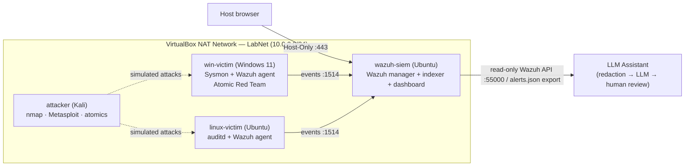

# AlertMind — AI-Assisted Mini SOC

> A working mini Security Operations Centre: a Wazuh SIEM with Windows + Linux telemetry, ATT&CK-mapped detections, dashboards, and IR playbooks — plus an LLM-powered tier-1 assistant that summarizes alerts and drafts triage output, measured for its actual impact on time-to-triage.

**Capstone:** PG Certificate in AI/GenAI Powered Cybersecurity (IIT Roorkee × Futurense) · EC-Council **SOC Essentials (SCE)** track · Project code **CAP-SCE-3W** · Mode: **Solo**

**Status:** 🟢 Week 1 infrastructure + Linux Wazuh-native detection pack complete (Wazuh + Windows/Linux ingestion verified) · 🟡 Sigma source, Windows rule verification, dashboards, playbooks, attack baseline, and LLM assistant in progress

---

## 1. Overview

A growing SaaS company's three-person SOC handles ~1,200 alerts/day at a ~35-minute mean time-to-triage. Leadership wants to consolidate logging, cut alert fatigue, and pilot an LLM tier-1 assistant before buying a commercial SOAR. AlertMind is that pilot, built end-to-end in a virtual lab.

The completed project will deliver:

- A **SIEM** (Wazuh) ingesting heterogeneous telemetry — Windows (Sysmon + Security/System channels) and Linux (auditd) — with sensible retention and RBAC.
- A **detection rule pack** authored in Sigma and converted to Wazuh-native rules, every rule mapped to **MITRE ATT&CK**.
- **Dashboards** (daily SOC briefing + ATT&CK heatmap) and three **NIST SP 800-61** IR playbooks.
- An **LLM tier-1 assistant** that, given an alert, returns a short summary, an ATT&CK technique tag, suggested investigation queries, and a draft user message — behind explicit guardrails (no autonomous actions, no secrets to the model, human review on every output, full prompt/response logging).
- A **measured impact** study: baseline vs. assisted triage time, reported honestly with threats-to-validity.

## 2. Architecture

All lab VMs share a VirtualBox **NAT Network** (`LabNet`, `10.0.2.0/24`), isolated from the physical LAN. The SIEM host carries a second Host-Only adapter for dashboard access from the host browser.



### Lab topology

| Role | VM | OS | Adapters | Key software | Status |
|---|---|---|---|---|---|
| SIEM host | `wazuh-siem` | Ubuntu | NAT + Host-Only | Wazuh 4.14.5 manager/indexer/dashboard | ✅ Deployed |
| Windows endpoint | `win-victim` | Windows 11 | NAT | Sysmon 15.21 + Wazuh agent | ✅ Deployed |
| Linux endpoint | `linux-victim` | Ubuntu | NAT | auditd + Wazuh agent | ✅ Deployed |
| Attacker | `attacker` | Kali | NAT | nmap, Metasploit, Atomic Red Team | ⏳ Week 2 |

Agents: `001 win-victim` (10.0.2.4), `002 linux-victim` (10.0.2.7), manager `10.0.2.15`.

## 3. Tech stack

| Layer | Tooling |
|---|---|
| SIEM | Wazuh 4.14.5 (all-in-one) |
| Endpoint telemetry | Sysmon (SwiftOnSecurity config) · auditd (custom `alertmind.rules`) |
| Cloud telemetry | AWS CloudTrail / Azure AD sign-in sample (planned) |
| Detection authoring | Sigma → Wazuh `local_rules.xml` |
| Attack simulation | Atomic Red Team |
| LLM assistant | LangChain / LangGraph + Streamlit (built on `AI-SOC-Assistant`) |
| Reporting | Markdown / PDF |

## 4. Repository structure

```
alertmind/
├── README.md                  # this file
├── WEEKLOG.md                 # weekly status notes
├── report.md                  # living technical report (started Week 1)
├── architecture/
│   ├── soc-architecture.md    # log sources, retention, RBAC, ingestion
│   └── diagram.drawio / .png
├── siem/
│   └── wazuh/                  # local_rules.xml, agent ossec.conf exports
├── detections/
│   ├── auditd/                 # alertmind.rules (auditd ruleset)
│   ├── sigma/                  # source-of-truth Sigma YAML (backfill in progress)
│   └── converted/              # Wazuh-native output + translation notes
├── playbooks/                 # phishing.md, malware.md, account-compromise.md
├── attack/                    # Atomic Red Team configs + run logs
├── assistant/                 # LLM tier-1 assistant (redaction, prompts, app, logs)
├── measurement/               # alert corpus, timing logs, analysis notebook
├── docs/runbooks/             # operational runbooks (e.g. wazuh-recovery.md)
└── evidence/                  # screenshots, hashes, screencasts
```

## 5. Detection coverage (ATT&CK)

Detections are deployed as Wazuh rules; the portable Sigma YAML source is being backfilled (`detections/sigma/`). Linux custom rules occupy IDs **100100–100115**; Windows leans on Sysmon-EID and Security/System channel rules.

**Status key:** ✅ Verified (alert observed in Wazuh with evidence) · 🟡 Configured (telemetry/rule in place, test pending) · ⏳ Planned.

**Windows (`win-victim`) — Sysmon + Security/System channels**

| Detection | Source | ATT&CK | Status |
|---|---|---|---|
| Process creation / suspicious shell | Sysmon EID 1 | T1059 / T1087 | ✅ Verified |
| New Windows service | System EID 7045 | T1543.003 | ✅ Verified (rule 61138) |
| LSASS process access | Sysmon EID 10 | T1003.001 | 🟡 Configured (EID 10 fix applied; alert test pending) |
| Run-key persistence | Sysmon EID 13 | T1547.001 | 🟡 Configured (config covers it; test pending) |

**Linux (`linux-victim`) — auditd custom rule pack**

Rule 100100 is verified firing end-to-end; the remaining rules are deployed (🟡 Configured) pending individual test triggers.

| Detection | Key | ATT&CK | Rule | Status |
|---|---|---|---|---|
| `/etc/shadow` read | `t1003_008_shadow_read` | T1003.008 | 100100 | ✅ Verified |
| User/group DB change | `t1136_accounts` | T1136 / T1098 | 100101 | 🟡 |
| sudoers tampering | `t1548_003_sudoers` | T1548.003 | 100102 | 🟡 |
| Cron persistence | `t1053_003_cron` | T1053.003 | 100103 | 🟡 |
| systemd service | `t1543_002_systemd` | T1543.002 | 100104 | 🟡 |
| Boot/init scripts | `t1037_init` | T1037 | 100105 | 🟡 |
| Shell init files | `t1546_004_shell_init` | T1546.004 | 100106 | 🟡 |
| LD_PRELOAD hijack | `t1574_006_ldpreload` | T1574.006 | 100107 | 🟡 |
| Kernel module / rootkit | `t1547_006_kmod` | T1547.006 / T1014 | 100108 | 🟡 |
| setuid/setgid change | `t1548_001_setuid` | T1548.001 | 100109 | 🟡 |
| auditd tampering | `t1562_001_audit_tamper` | T1562.001 | 100110 | 🟡 |
| Login-log tampering | `t1070_logs` | T1070 | 100111 | 🟡 |
| Timestomping | `t1070_006_timestomp` | T1070.006 | 100112 | 🟡 |
| SSH key access | `t1552_004_ssh_keys` | T1552.004 | 100113 | 🟡 |
| sshd_config change | `t1098_004_sshd_config` | T1098.004 | 100114 | 🟡 |
| Package mgr / repo config change | `t1105_software_mgmt` | T1195.001 *(tentative)* | 100115 | 🟡 |

## 6. Quickstart

Full, verified steps live in [`architecture/soc-architecture.md`](architecture/soc-architecture.md) and the implementation plan. In brief:

```bash
# 1. SIEM (wazuh-siem, Ubuntu)
curl -sO https://packages.wazuh.com/4.14/wazuh-install.sh && sudo bash ./wazuh-install.sh -a

# 2. Linux endpoint — auditd rules + Wazuh ingestion
sudo cp detections/auditd/alertmind.rules /etc/audit/rules.d/alertmind.rules
sudo augenrules --load
#   add the <localfile> audit block to /var/ossec/etc/ossec.conf, then:
sudo systemctl restart wazuh-agent

# 3. Manager — custom detection rules (the standard Wazuh local_rules.xml)
xmllint --noout siem/wazuh/local_rules.xml                    # validate first
sudo cp siem/wazuh/local_rules.xml /var/ossec/etc/rules/local_rules.xml
sudo systemctl restart wazuh-manager
sudo tail -50 /var/ossec/logs/ossec.log                       # confirm clean load
```

Windows endpoint: install Sysmon with the provided config, deploy the Wazuh agent, and forward the `Microsoft-Windows-Sysmon/Operational`, `System`, and `Security` channels.

## 7. Current status

- [x] Wazuh SIEM deployed and healthy (manager + indexer + dashboard)
- [x] Windows telemetry onboarded (Sysmon EID 1/10, System 7045, Security)
- [x] Linux telemetry onboarded (auditd → Wazuh, custom rule pack firing)
- [x] Detection pipeline verified end-to-end (auditd → decoder → custom rule → ATT&CK-tagged alert)
- [x] VMs snapshotted in a clean post-setup state
- [ ] Sigma YAML source for the rule pack
- [ ] Cloud telemetry (sample CloudTrail / Azure AD)
- [ ] Dashboards (daily briefing + ATT&CK heatmap)
- [ ] IR playbooks (phishing, malware, account compromise)
- [ ] Atomic Red Team attack chain + baseline measurement
- [ ] LLM assistant + guardrails + assisted measurement
- [ ] Final report + defense deck

## 7a. Evidence map

Every "Verified" claim above maps to a captured artifact in `evidence/`. (IDs are referenced from `report.md`.)

| Evidence ID | What it proves | File / screenshot |
|---|---|---|
| EVID-WAZUH-001 | Wazuh services + ports healthy | `evidence/week1/wazuh-services-ports.png` |
| EVID-WIN-001 | Sysmon EID 1 process creation ingested | `evidence/week1/win-sysmon-eid1-whoami.png` |
| EVID-WIN-002 | Windows service creation (7045 → rule 61138) | `evidence/week1/win-system-7045-service.png` |
| EVID-LIN-001 | Linux user creation detected | `evidence/week1/linux-useradd-t1136.png` |
| EVID-LIN-002 | auditd `/etc/shadow` rule 100100 fired (T1003.008) | `evidence/week1/linux-shadow-t1003-008.png` |
| EVID-RULES-001 | `local_rules.xml` validates + loads clean | `evidence/week1/wazuh-rules-load.png` |

*Capture the listed screenshots into `evidence/week1/` as you re-verify each item.*

## 8. Measurement approach

The brief conflates two metrics; AlertMind separates them deliberately:

- **MTTD** (attack → alert fires) is a property of the *detection rules*, not the assistant — the assistant does not improve it.
- **Time-to-triage** (analyst opens alert → disposition + drafted comms) is what the assistant can plausibly move.

To beat the n=1 problem, impact is measured over an **alert corpus** drawn from the Atomic runs, split into matched assisted/unassisted sets, with both **speed and accuracy** (assistant ATT&CK tag vs. ground truth, hallucination rate) reported. See `measurement/`.

## 9. Responsible AI use

Per the program's Responsible AI requirements:

- The assistant **never executes actions** — it outputs query text and drafts only; a human reviews every output.
- A **redaction layer** strips credentials, tokens, and secrets before any prompt leaves the runner; lab alerts are synthetic.
- **Every LLM call is logged** (prompt, response, model, version) and every kept output is verifiable against raw alert evidence.
- All AI use is disclosed in `report.md` (model, purpose, verification method).

## 10. Code reuse & attribution

This project reuses the alert-summarization core from the author's prior **[AI-SOC-Assistant](https://github.com/)** repository (permitted; disclosed for academic integrity). Reused modules are isolated under `assistant/` and noted in their headers. Everything else — the redaction layer, SOC prompt library, logging, SIEM integration, detection content, dashboards, playbooks, and measurement harness — is new for this capstone.

## 11. Ethics & scope

All offensive activity is confined to the lab `LabNet` network; no real-world targets. No real credentials, customer data, or copyrighted content is used. Evidence and logs remain confidential within the cohort.

## References

- MITRE ATT&CK — https://attack.mitre.org
- NIST SP 800-61 (Computer Security Incident Handling)
- NIST Cybersecurity Framework 2.0 — https://www.nist.gov/cyberframework
- Wazuh documentation — https://documentation.wazuh.com

---

*Built for the IIT Roorkee × Futurense PG Certificate in AI/GenAI Powered Cybersecurity, Cohort 1.*
